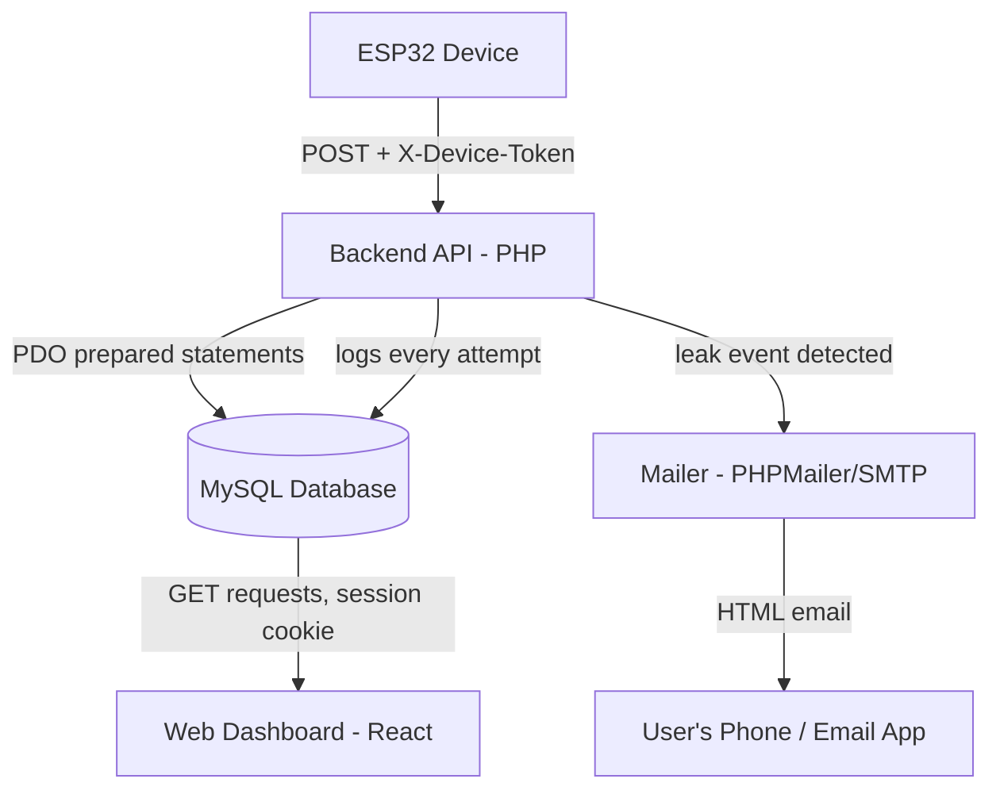

# 2. System Architecture Document

## 2.1 High-Level Data Flow



Text form of the same flow, as requested:

```
ESP32
  |
  v
Backend API (PHP, PDO/MySQL)
  |
  v
Database (MySQL)
  |
  v
Web Dashboard (React, polls every 2s on live pages)
  |
  v
Automatic Email Notification (only on real leak events, via PHPMailer/SMTP)
```

## 2.2 Component Responsibilities

### ESP32 (not yet built — firmware is out of scope for this repo)
- Reads physical flow sensors and (once wired) the valve state.
- Batches routine usage readings and posts them to `ingest_usage.php`.
- On leak detection (its own logic — not part of this codebase), posts a
  single event to `ingest_leakage.php`.
- Authenticates with a shared secret (`X-Device-Token` header), not a user
  session.
- Is responsible for its own retry/backoff on network failure (see
  `05_ESP32_INTEGRATION_GUIDE.md`).

### Backend (PHP, `Backend/*.php`)
- One file per endpoint; every endpoint (except `export.php`) includes
  `bootstrap.php`, which handles CORS, security headers, session
  configuration, and the shared PDO connection (`db()`).
- Validates and stores everything it receives — no endpoint trusts
  unvalidated input into a query (all queries are parameterized).
- Is the **only** place business logic lives: report calculations, leak
  deduplication, notification triggering, and password/session handling
  all happen here. The frontend never computes a number the backend hasn't
  already provided.
- Owns outbound email via `mailer.php` and logs every attempt to
  `notifications_log` regardless of success/failure.
- Never trusts the client for anything security-relevant: passwords are
  hashed server-side, session identity comes from the PHP session, device
  identity comes from a `hash_equals()`-compared shared token.

### Database (MySQL, `Backend/schema.sql`)
- Single source of truth for every number and every record shown anywhere
  in the frontend. There is no cache layer and no derived/duplicated data
  store.
- Four tables: `users`, `usage_readings`, `leakage_events`,
  `notifications_log` (full detail in `03_DATABASE_DOCUMENTATION.md`).
- Enforces data integrity the application also enforces in code: foreign
  keys with `ON DELETE CASCADE`, a `UNIQUE(user_id, event_key)` constraint
  that makes duplicate leak-event inserts impossible even if the PHP-level
  dedup check were ever bypassed.

### Frontend (React, `src/routes/*.tsx`)
- Renders what the backend returns; performs no independent calculation of
  business figures (dashboard averages, report percentages, efficiency
  scores are all backend-computed).
- Live pages (Dashboard, Reports, Notification History, Usage Trend,
  Leakage Events) poll their endpoint every 2 seconds so new ESP32 data
  and new leak events appear without a manual reload.
- Session state is a single `useAuth()` context backed by `me.php`;
  `RequireAuth` gates every authenticated route and redirects to `/` if
  there's no session.
- Never talks to the database directly — everything goes through
  `src/lib/api.ts`'s `getJson`/`postForm`/`downloadUrl` helpers, which call
  the PHP endpoints with `credentials: "include"` so the session cookie is
  sent.

## 2.3 Request/Response Pattern
Every JSON endpoint (all except `export.php`) returns a consistent shape:
```json
{ "success": true, ...endpoint-specific fields... }
{ "success": false, "message": "human-readable reason" }
```
On an uncaught server exception, the backend returns:
```json
{ "success": false, "message": "Something went wrong on our end. Please try again." }
```
with the real exception logged server-side (never sent to the client) —
see `12_TROUBLESHOOTING_GUIDE.md` for how to find that log.

## 2.4 Authentication Model (two independent identities)
1. **Human user** → PHP session cookie, `HttpOnly`, `SameSite=None; Secure`
   over HTTPS (set on login, checked by `require_login()`).
2. **ESP32 device** → shared secret `DEVICE_INGEST_TOKEN`, sent as the
   `X-Device-Token` header, compared with `hash_equals()` (timing-safe).
   The two ingestion endpoints (`ingest_usage.php`, `ingest_leakage.php`)
   accept **either** a valid device token **or** a logged-in session, so
   they can also be exercised manually (e.g. via Postman) while signed in.

### CSRF protection
Because the frontend and backend are on different origins in production,
the session cookie must be `SameSite=None`, which alone does not stop a
forged cross-site `<form>` POST from riding along with a logged-in
victim's cookie. `change_password.php`, `update_profile.php`,
`delete_account.php`, and `notification_settings.php` (its `POST` branch
only) additionally call `require_csrf_header()` (`bootstrap.php`), which
rejects the request unless it carries `X-Requested-With: XMLHttpRequest`.
A bare HTML form cannot set that header; only a script-driven
`fetch`/`XHR` call can, and doing so cross-origin first requires the
`ALLOWED_ORIGINS` CORS check to pass. The frontend's `postForm()` helper
(`src/lib/api.ts`) sends this header on every POST automatically, so no
per-call changes were needed in any route file. Read-only `GET` endpoints
and the two ESP32 ingestion endpoints (already gated by session-or-device-token)
do not require it.

## 2.5 Why the Dashboard "just works" once hardware is connected
No code path in the frontend distinguishes "real ESP32 data" from "data
inserted any other way" — a row in `usage_readings` or `leakage_events` is
a row, regardless of how it got there. This means the moment the ESP32
starts calling `ingest_usage.php` / `ingest_leakage.php` with valid data,
every page that reads from those tables (Dashboard, Usage, Usage Trend,
Leakage, Reports, Export, Notification History) reflects it automatically,
without any additional backend work.
